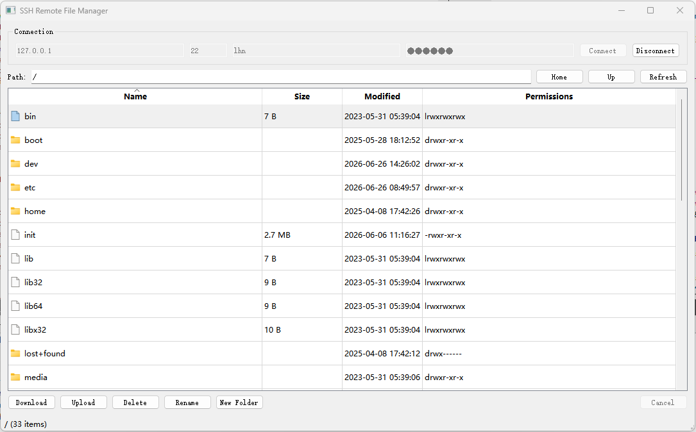

# 安装libssh2

1. 安装libssh2，它比QSSH快，之前用QSSH做的远程文件管理系统下载文件非常慢，而且下载过程还会自动断开ssh连接，参考网上的代码也是很慢，所以不再使用QSSH库，而是使用libssh2。

   我参考了以下关于QSSH的代码，都是很慢的，所以不是代码的问题，而是这个库本身就不太适合用于下载文件

   [Qt+QSSH实现SFTP - 朱小勇 - 博客园](https://www.cnblogs.com/judes/p/18797522)

   [QT + QSsh 文件上传及下载_qt ssh-CSDN博客](https://blog.csdn.net/qq_32863863/article/details/137824607)

2. 安装libssh2：

   先按照vcpkg（我安装在D:\Install\vcpkg）

   使用git:

   ```shell
   git clone https://github.com/microsoft/vcpkg.git
   ```

   vcpkg后，打开cmd，使用 cd 命令进入 vcpkg 目录（D:\Install\vcpkg）：

   ```cmd
   cd vcpkg
   bootstrap-vcpkg.bat
   ```

   成功后会生成：vcpkg.exe

   然后继续在命令行中输入：

   ```cmd
   vcpkg install libssh2:x64-windows
   ```

   它会自动安装：

   - OpenSSL
   - zlib
   - libssh2

3. 验证安装libssh2，在cmd中：

   ```cmd
   D:\Install\vcpkg\vcpkg>vcpkg list
   libssh2:x64-windows                               1.11.1#3            libssh2 is a client-side C library implementing ...
   libssh2[openssl]:x64-windows                                          Use the openssl crypto backend
   libssh2[zlib]:x64-windows                                             Use compression via zlib
   openssl:x64-windows                               3.6.2               OpenSSL is an open source project that provides ...
   vcpkg-cmake-config:x64-windows                    2024-05-23
   vcpkg-cmake-get-vars:x64-windows                  2025-05-29
   vcpkg-cmake:x64-windows                           2024-04-23
   zlib:x64-windows                                  1.3.2               A compression library
   ```

4. 使用libssh2实现远程文件管理（下载、删除文件等），在qt5.15.2 msvc2019上运行。架构可参考：

   UI线程
       |
       | signal/slot
       v
   SshWorker(QThread)
       |
       +-- socket
       +-- libssh2 session
       +-- sftp

   文件操作不能阻塞主线程

5. 

# 代码执行方法

1. **ibssh2Test要把vpckg安装目录中的3个.dll复制到exe同级目录下，才能运行成功**。**分别是libssh2.dll 、libcrypto-3-x64.dll 、 z.dll**

2. ibssh2Test运行成功，使用ubuntu测试。

   需要先在ubuntu中：

   ```shell
   lhn@DESKTOP-6GB7R60:~$ sudo service ssh start
   lhn@DESKTOP-6GB7R60:~$ sudo service ssh status
   ```

   

